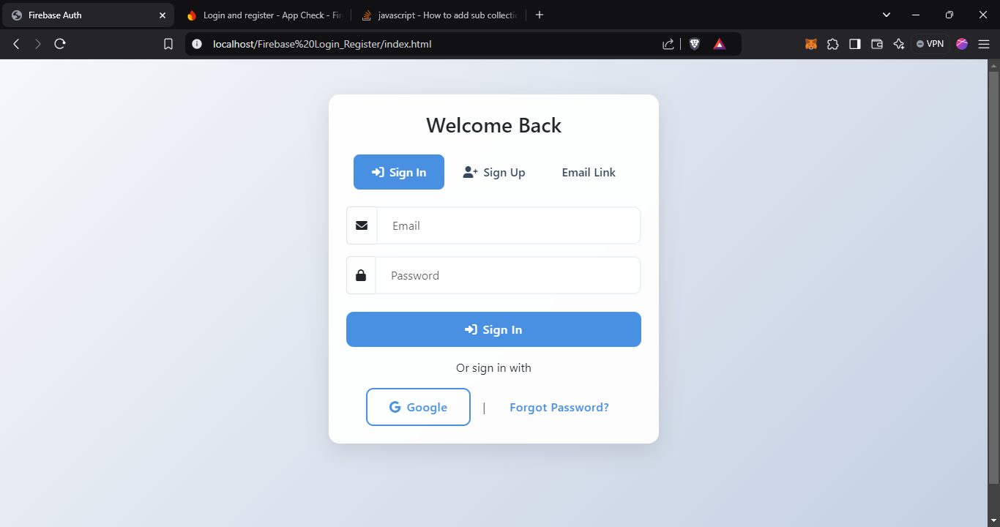
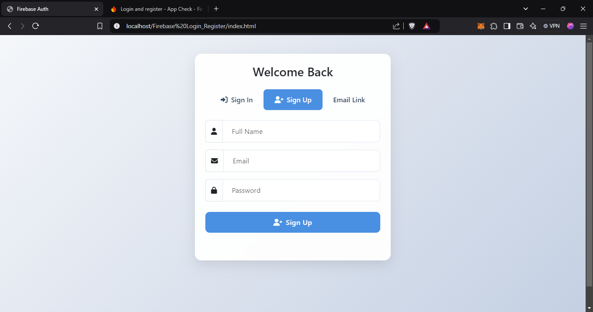
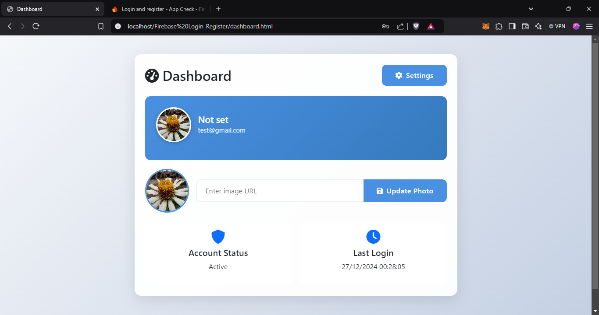

# Firebase Authentication System

A modern authentication system using Firebase with features like login history tracking, profile management, theme switching, and secure auto-login capabilities.

## ✨ New Features Added

### 🌓 Theme System
- Dynamic light/dark theme switching
- System theme preference detection
- Persistent theme settings
- Smooth transitions between themes

### 🔐 Enhanced Security
- Automatic login with remember me functionality
- Secure credential storage
- Session persistence
- Auto-cleanup of expired sessions

### 🎨 UI/UX Improvements
- Responsive theme toggle in header
- Theme-aware components
- Improved form accessibility
- Enhanced visual feedback

## 🚀 Features

### Authentication
- Email/Password login
- Google OAuth integration
- Passwordless email links
- Password reset functionality

### Security
- PIN protection
- Login history (last 20 entries)
- Device tracking
- IP logging

### Profile Management
- Photo URL management
- Real-time updates
- User information display

## 🛠️ Technical Implementation

### Firebase Services Used
- Firebase Authentication
- Realtime Database
- Security Rules Implementation

### Theme System

### Database Structure

## Project Structure

```
Firebase Login_Register/
│
├── index.html
├── dashboard.html
├── README.md
├── src/
│   ├── script/
│   │   ├── auth.js
│   │   ├── dashboard.js
│   │   ├── firebase-config.js
│   │   ├── profile.js
│   ├── style/
│   │   ├── style.css
```

## Setup Instructions

### Prerequisites

- Node.js and npm installed
- Firebase project created
- Firebase Authentication and Realtime Database enabled

### Firebase Configuration

1. Go to the Firebase Console and create a new project.
2. Enable Email/Password authentication in the Authentication section.
3. Enable Realtime Database and set the rules to allow authenticated users to read and write their own data.

### Database Rules

Set the following rules in the Firebase Realtime Database:

```json
{
  "rules": {
    "users": {
      "$uid": {
        ".read": "$uid === auth.uid",
        ".write": "$uid === auth.uid",
        "loginHistory": {
          ".indexOn": ["timestamp"]
        }
      }
    }
  }
}
```

### Project Configuration

1. Clone the repository:

```bash
git clone https://github.com/your-username/firebase-login-register.git
cd firebase-login-register
```

2. Update the Firebase configuration in `src/script/firebase-config.js` with your project's details:

```javascript
const firebaseConfig = {
    apiKey: "YOUR_API_KEY",
    authDomain: "YOUR_AUTH_DOMAIN",
    databaseURL: "YOUR_DATABASE_URL",
    projectId: "YOUR_PROJECT_ID",
    storageBucket: "YOUR_STORAGE_BUCKET",
    messagingSenderId: "YOUR_MESSAGING_SENDER_ID",
    appId: "YOUR_APP_ID"
};
```

### Running the Project

1. Open `index.html` in your browser to access the login and registration page.
2. After logging in, you will be redirected to `dashboard.html` where you can update your profile photo using a URL.

## File Descriptions

### index.html

The main entry point for the application. Contains the login and registration forms.

### dashboard.html

The user dashboard where authenticated users can update their profile photo using a URL.

### src/script/auth.js

Handles user registration and login using Firebase Authentication.

### src/script/dashboard.js

Manages the user dashboard, including displaying user information and handling sign-out.

### src/script/firebase-config.js

Contains the Firebase configuration and initializes Firebase services.

### src/script/profile.js

Handles updating the user's profile photo using a URL and storing the URL in Firebase Realtime Database.

### src/style/style.css

Contains custom styles for the application, including form and button styles.

## Screenshots

### Login Page




### Registration Page



### Dashboard




## License

This project is licensed under the MIT License. See the [LICENSE](LICENSE) file for details.

## Contributing

Contributions are welcome! Please open an issue or submit a pull request for any improvements or bug fixes.

## Contact

For any questions or support, please contact [contact.minggudev@gmail.com](mailto:contact.minggudev@gmail.com).
